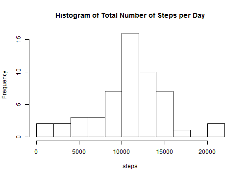
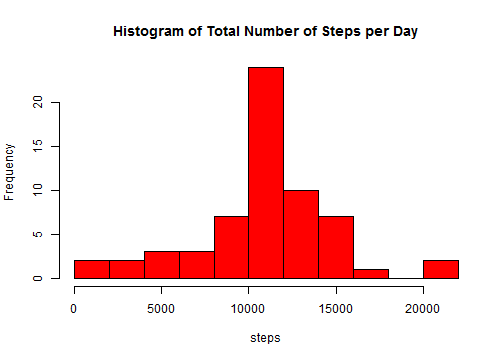

## Loading and preprocessing the data


```r
activity <- read.csv("C:/Users/Janson Lu/Desktop/dataActivity/activity.csv", stringsAsFactors=FALSE)
date <- with(activity, strptime(date,"%Y-%m-%d"))
activity$date <- date
```


## What is mean total number of steps taken per day?


```r
#Total number of steps per day
stepsPerDay <- aggregate(activity$steps, by=list(time=as.character(activity$date)), FUN=sum)
names(stepsPerDay)[2] <- "step"
#Plot the histogram of total number of steps per day
hist(stepsPerDay$step, breaks =10, main = "Histogram of Total Number of Steps per Day",xlab="steps")
```

 

Then we calculate the mean and median value.

```r
mean <- mean(stepsPerDay$step, na.rm=T)
median <- median(stepsPerDay$step, na.rm=T)
```
The mean value of the total number of steps taken per day is 1.0766189 &times; 10<sup>4</sup>.
The median value of the total number of steps taken per day is 10765.


## What is the average daily activity pattern?


```r
#a time series plot of the 5-minute interval (x-axis) and the average number of steps taken, averaged across all days (y-axis)
meanStep <- with(na.omit(activity),aggregate(steps, by=list(Interval=interval), FUN=mean))
with(meanStep,plot(Interval,x,main="5-minute interval and the average number of steps taken",type='l',col='blue',ylab="Average Step"))
```

 

Then we find on which interval steps reached climax.

```r
max <- max(meanStep$x)
interval <- meanStep[meanStep$x == max,][,1]
max
```

```
## [1] 206.1698
```

```r
interval
```

```
## [1] 835
```


## Imputing missing values

First, calculate total number of rows having missing values.

```r
missing <- sum(is.na(activity))
missing
```

```
## [1] 2304
```

Then, we will use mean value for each interval to fill in the missing values, creating a new dataset called data with mean values filled in.

```r
data <- activity
for(i in 1:nrow(data))
    if(is.na(data[i,1]))
       data[i,1] <- meanStep[meanStep$Interval == data[i,3],]$x
```

Make a histogram of the total number of steps taken each day.

```r
stepsPerDay2 <- aggregate(data$steps, by=list(time=as.character(data$date)), FUN=sum)
names(stepsPerDay2)[2] <- "step"
hist(stepsPerDay2$step, breaks =10,col='red', main = "Histogram of Total Number of Steps per Day",xlab="steps")
```

 

Finally, calculate mean value and median total number of steps taken per day.


```r
mean <- mean(stepsPerDay2$step, na.rm=T)
median <- median(stepsPerDay2$step, na.rm=T)
mean
```

```
## [1] 10766.19
```

```r
median
```

```
## [1] 10766.19
```

We can observe that the mean value is the same as the first part of this assignment, but median value differs. Imputing mising values with mean value for each interval impacted the median but not mean value of the total number of daily steps.


## Are there differences in activity patterns between weekdays and weekends?

First, create a new factor variable in the dataset(with filled in missing values) with two levels – “weekday” and “weekend” indicating whether a given date is a weekday or weekend day.


```r
week<-weekdays(data$date)
for(i in 1:length(week)){
    if(week[i] == "Saturday" | week[i] == "Sunday"){
        week[i]<-"weekend"}else{
        week[i]<-"weekday"}
    }
data$week <- as.factor(week)
```

Make a panel plot of the 5-minute interval (x-axis) and the average number of steps taken, averaged across all weekday days or weekend days (y-axis).


```r
weekdayData <- data[week=="weekday",]
weekendData <- data[week=="weekend",]
meanStepDay <- with(weekdayData,aggregate(steps, by=list(Interval=interval), FUN=mean))
meanStepEnd <- with(weekendData,aggregate(steps, by=list(Interval=interval), FUN=mean))
par(mfrow = c(2,1),cex = 0.8)
with(meanStepDay,plot(Interval,x,main="Weekday",type='l',col='red',ylab="Average Step"))
with(meanStepEnd,plot(Interval,x,main="Weekend",type='l',col='purple',ylab="Average Step"))
```

 
